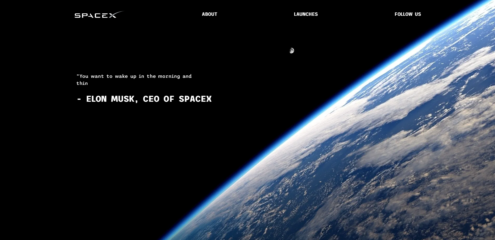
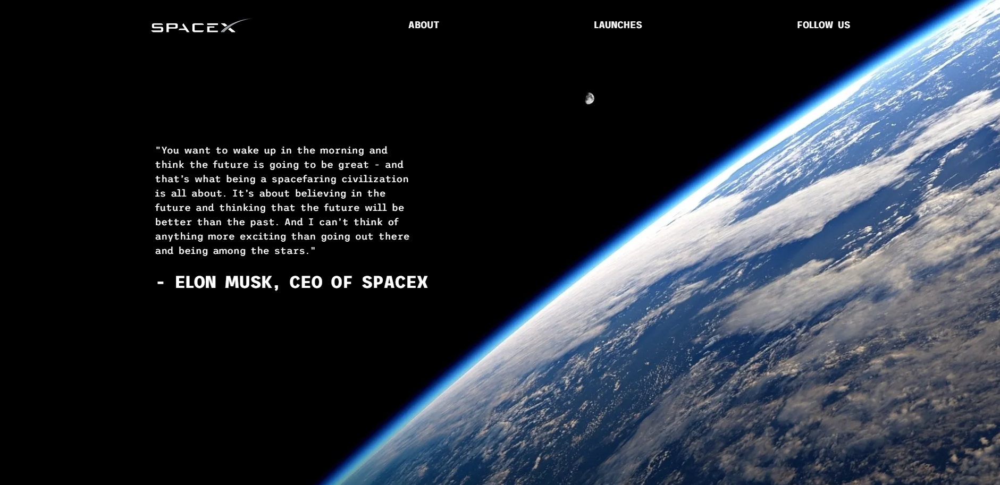
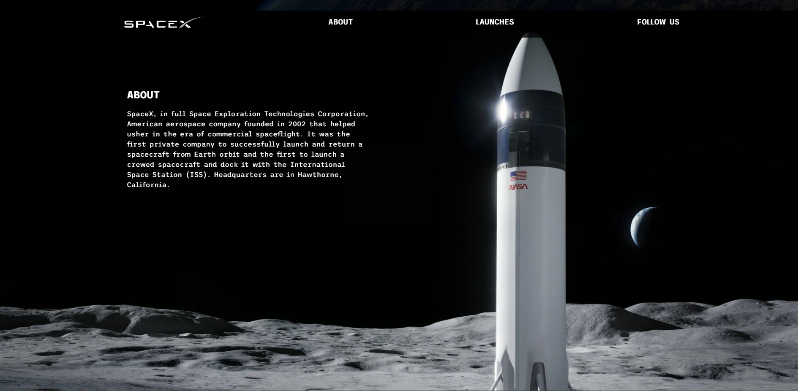
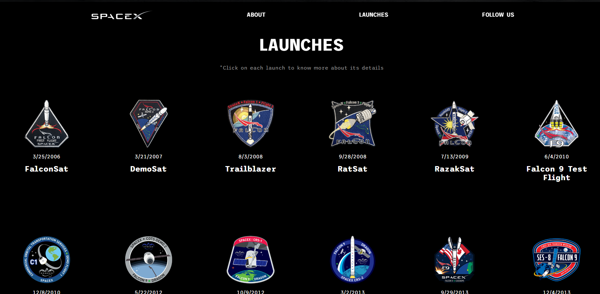
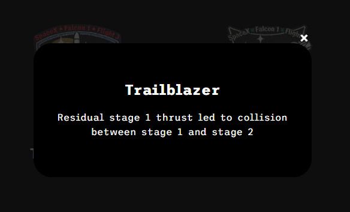
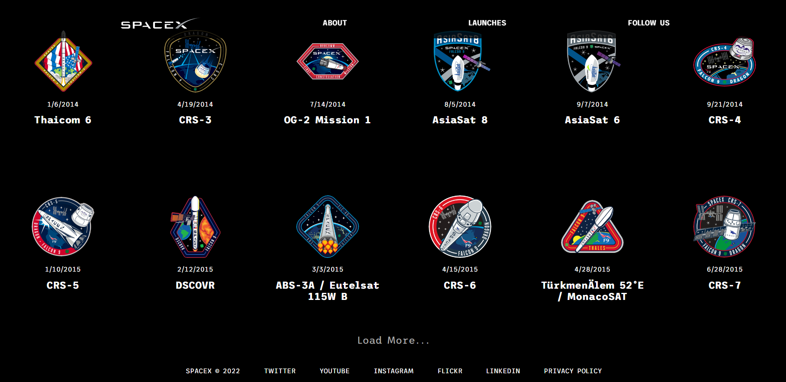

<h1 align="center" id="top">SpaceX-Rocket-Launches-Timeline</h1>

<a href="https://rahymcharyyev.github.io/SpaceX-Rocket-Launches-Timeline/">PRODUCTION</a>

&#xa0;

  

  

  

  <!--  -->

  <!--  -->

  <!--  -->

  

<!-- Status -->

<!-- <h4 align="center">
	🚧  SpaceX-Rocket-Launches-Timeline 🚀 Under construction...  🚧
</h4>

 -->

  <a href="#dart-about">About</a> &#xa0; | &#xa0; 
  <a href="#sparkles-features">Features</a> &#xa0; | &#xa0;
  <a href="#rocket-technologies">Technologies</a> &#xa0; | &#xa0;
  <a href="#white_check_mark-requirements">Requirements</a> &#xa0; | &#xa0;
  <a href="#checkered_flag-starting">Starting</a> &#xa0; | &#xa0;
  <a href="#memo-screenshots">Screenshots</a> &#xa0; | &#xa0;
  <a href="#memo-contact">Contacts</a> 

 

## :dart: About

In this project I used a SPACEX API (https://api.spacexdata.com/v5/) to create timeline of rocket launches of the SPACEX company. This website was created with html, css and vanilla js.

## :sparkles: Features

:heavy_check_mark: Users can see all the rocket launches of the SPACEX company.\
:heavy_check_mark: Also users are able to see the additional description of the each launch.\
:heavy_check_mark: Added pagination functionality, you can see more launches by clicking the Load more button.\

## :rocket: Technologies

The following tools were used in this project:

- [HTML](https://developer.mozilla.org/ru/docs/Web/HTML)
- [CSS](https://developer.mozilla.org/ru/docs/Web/CSS/Reference)
- [JavaScript](https://developer.mozilla.org/en-US/docs/Web/JavaScript)
- [Modernizr](https://modernizr.com/)
- [TypeWriter.js](https://typewriter.js.org/)

## :memo: Screenshots

 \
&#xa0;
 \
&#xa0;
 \
&#xa0;
 \
&#xa0;
 \
&#xa0;
 \
&#xa0;

## :memo: Contact

For any inquiries or questions, please contact <a href="https://github.com/RahymCharyyev" target="_blank">Rahym Charyyev</a>

&#xa0;

<a href="#top">Back to top</a>
